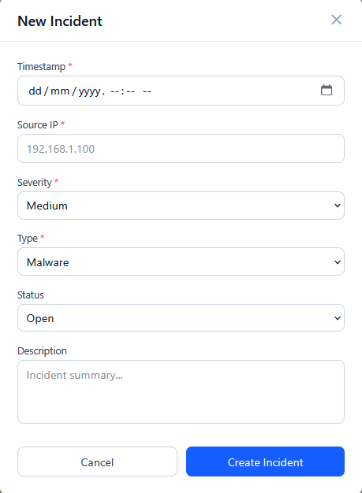
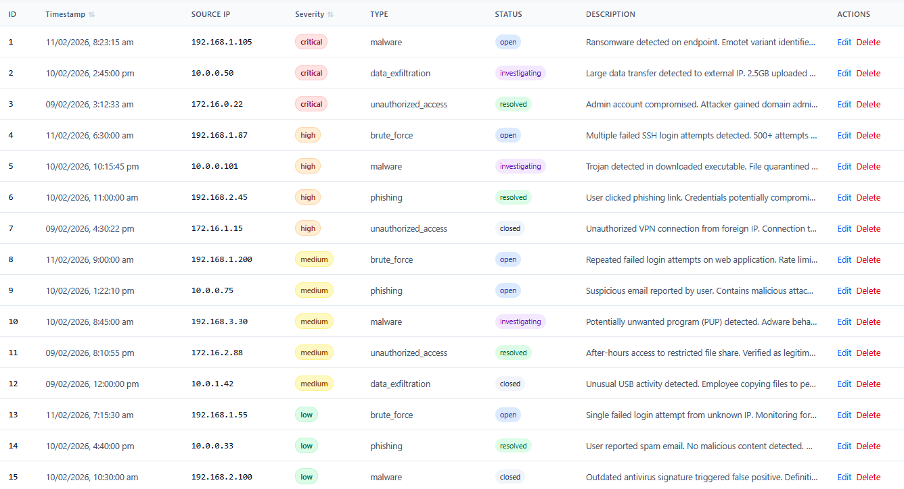
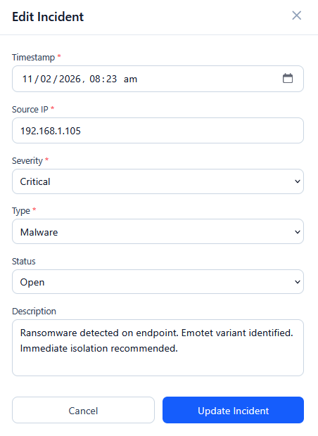
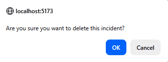
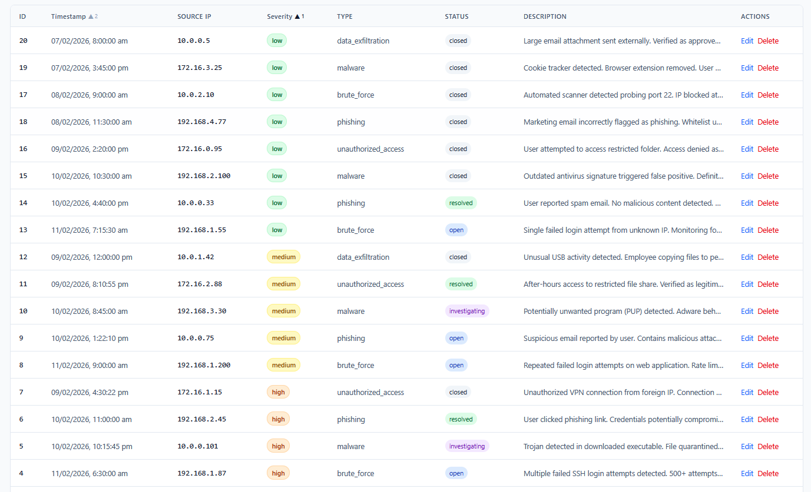
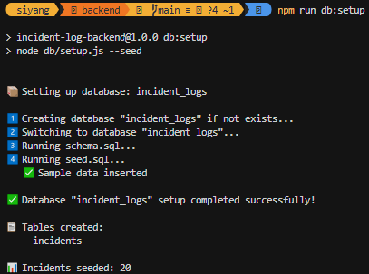
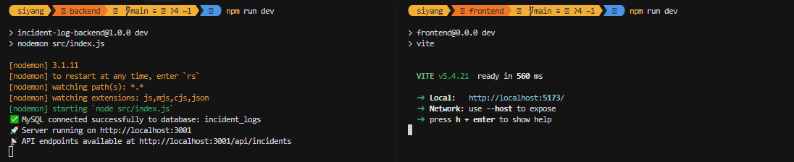

# SK Interview Project — Endpoint Incident Log Processor

## Overview

Built a full-stack web application that allows a security analyst to view and manage endpoint incident logs. The application should demonstrate your ability to build a complete CRUD interface with a modern web stack.

## Tech Stack Used

- **Frontend:** React with Tailwind CSS
- **Backend:** Node.js with Express
- **Database:** MySQL

## Requirements

### Data Model — `incidents`

| Field | Type | Description |
|---|---|---|
| `id` | UUID or Auto-increment | Primary key |
| `timestamp` | DateTime | When the incident occurred |
| `source_ip` | String | Origin IP address |
| `severity` | Enum | `low`, `medium`, `high`, `critical` |
| `type` | String | e.g. `malware`, `brute_force`, `phishing`, `unauthorized_access`, `data_exfiltration` |
| `status` | Enum | `open`, `investigating`, `resolved`, `closed` |
| `description` | Text | Incident summary |

### CRUD Operations

1. **Create** — Add a new incident log via a form. *In production, incidents would be ingested automatically from a SIEM, EDR agent, or API. For this project, a manual form is sufficient.*  


2. **Read** — Display all incidents in a table  


3. **Update** — Edit an incident's details or change its status  


4. **Delete** — Remove an incident  


### UI Requirements

- Incidents displayed in a **table** with all fields visible
- Severity should be **color-coded** (e.g. red for critical, orange for high, yellow for medium, green for low)

## Bonus Features

These are not required but will strengthen your submission:

- **Sorting** — Sort the table by timestamp or severity
    -  Table can be sorted by timestamp and/or severity, with nested sorting based on the order that either column was pressed. For example, the Timestamp then Severity columns were pressed, therefore resulting in the table being sorted by Severity first, followed by timestamp.  

  
~~- **Filtering/search** — Filter by severity, status, or IP address~~  
~~- **Pagination** — Paginate the table for large datasets~~  
~~- **Additional fields** — `destination_ip`, `endpoint_hostname`, `analyst_notes`~~  
~~- **Bulk JSON import** — Upload and parse a JSON file of incident records~~  
~~- **Dashboard summary** — Show counts by severity or status~~  
~~- **Input validation** — Validate IP address format, sanitize inputs~~

## Getting Started

1. Fork or clone this repository
2. Set up your frontend and backend in this project
3. Include a seed script or sample data so reviewers can test with realistic data

## Setup Instructions

Before setup, first ensure that you have the following:
1. node (Go to https://nodejs.org/en/download to download if not avail)
2. MySQL (Go to https://dev.mysql.com/downloads/installer/ to download if not avail)  
    - Do setup the necessary DB secrets (such as DB username and password) in the backend folder, using .env.example as a guide
    - Note: Do make sure that the Path env variable is setup correctly after installing (i.e. for Windows, it should be similar to `C:\Program Files\MySQL\MySQL Server 8.0\bin`)

To setup:
1. Go to backend folder and run the following code. Repeat the same action in the frontend folder
```
npm install 
```

2. (Backend only) When running the backend for the first time, you will need to seed the database with some data. Run the following command to do that
```
npm run db:setup
```
Once that is done, you should see the following output  


3. (Frontend only) Update the .env variable in the frontend folder to define the backend endpoint that the frontend server will query.

4. In both backend and frontend folders, run the following command to start their respective servers:
```
npm run dev
```
When successful, the output should look something like this:  


## Submission

Submit your work by opening a **Pull Request** against the `main` branch of this repository.

## Evaluation Criteria To be placed in the git PR

| Area | What We Look For |
|---|---|
| **Functionality** | All CRUD operations work correctly |
| **Code Quality** | Clean, readable, well-organized code |
| **Database Design** | Proper schema with appropriate types |
| **UI/UX** | Clear layout and intuitive interaction |
| **Security Awareness** | Input validation, parameterized queries |
| **Documentation** | Clear setup instructions |
